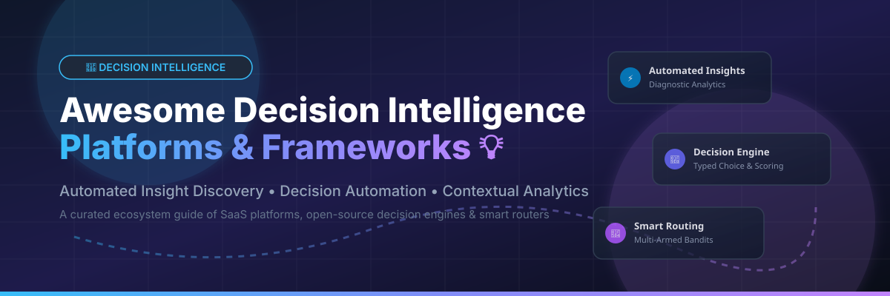

# 💡 Awesome Decision Intelligence Platform

  

  
  
  
  

## 📌 Top Decision Intelligence Platforms Ecosystem

**Curated List of SaaS Products & Open-Source GitHub Projects**

*Focused on Automated Insight Discovery, Decision Automation, Contextual Analytics, and Intelligent Routing Frameworks.*

**Last updated: October 2026**

---

This repository tracks notable **SaaS platforms** and **open-source projects** for **Decision Intelligence (DI)**. These tools help organizations move beyond static dashboards and business intelligence (BI) to automatically discover why metrics change, generate actionable recommendations, orchestrate model routing, and automate complex enterprise decision workflows.

---

## 📑 Table of Contents

- [📊 Market Overview & Size](#-market-overview--size)
- [🏢 SaaS/Hosted Platforms](#-saashosted-platforms)
- [💻 Open-Source GitHub Projects](#-open-source-github-projects)
- [🤝 How to Contribute](#-how-to-contribute)
- [💖 Support & Sponsorship](#-support--sponsorship)
- [⚠️ Disclaimer](#%EF%B8%8F-disclaimer)
- [📈 Star History](#-star-history)

---

## 📊 Market Overview & Size

> 💡 **Market Size & Structure**: The global Decision Intelligence market is estimated at **$13.4 Billion in 2026** and is projected to grow at a **CAGR of ~18.5%** over the next decade. The sector is **moderately fragmented**, undergoing rapid consolidation as enterprise automation giants acquire niche DI platforms (e.g., *UiPath acquiring Peak AI*, *ServiceNow acquiring Pyramid Analytics*, *Snowflake acquiring Sisu Data*). Commercial vendors dominate automated diagnostic analytics and entity resolution, while open-source options focus primarily on rule execution engines, typed decision primitives, and smart LLM routers.

---

## 🏢 SaaS/Hosted Platforms

| Platform | Company Size / Valuation / Revenue | Starting Price | Free Tier / Trial Limit | Key Capabilities & Highlights |
| :--- | :--- | :--- | :--- | :--- |
| **[DataRobot AI Cloud](https://www.datarobot.com/)** 🤖 | **$1.1B+ Valuation** (~$300M ARR) | ~$2,500 / month (annual contract) | 30-day free trial (Full platform access for Generative AI & AutoML) | Unified AI platform providing end-to-end Decision Intelligence Flows, AutoML, continuous model monitoring, and MLOps to automate decisions beyond raw predictions. |
| **[Quantexa](https://www.quantexa.com/)** 🕸️ | **$2.6B Valuation** ($100M+ ARR) | ~$5,000 / month (Enterprise Quote) | No free trial available (Request-based enterprise pilot programs) | Purpose-built DI platform featuring the patented Quantexa Knowledge Graph (QKG), entity resolution, agentic AI gateways (MCP/A2A), and enterprise risk analytics. |
| **[C3 AI](https://c3.ai/)** 🏭 | **~$2.5B Market Cap** ($232M TTM Revenue) | $0.55 / vCPU-hour ($250k / 3-mo pilot) | 14-day free trial (C3 Generative AI Standard Edition via AWS Marketplace) | Enterprise AI platform offering modular operational ontologies, C3 Code application packages, and turnkey decision apps across defense, finance, and manufacturing. |
| **[Sapiens Decision](https://www.sapiens.com/)** 📜 | **$2.5B Acquisition** ($500M+ Revenue) | ~$3,000 / month (Enterprise Quote) | No free trial available (Custom enterprise demo upon request) | Enterprise decision management platform turning complex business logic and business rules into reusable corporate assets with full auditing and versioning. |
| **[Pyramid Analytics](https://www.pyramidanalytics.com/)** 📐 | **~$1B Valuation** (Acquired by ServiceNow, ~$50M Revenue) | ~$1,000 / month (User/Server base) | 30-day free trial (Complete platform access with virtual semantic models) | All-in-one DI platform unifying data prep, business analytics, and data science. Features the PYRANA direct query engine and centralized business logic governing. |
| **[Tellius](https://www.tellius.com/)** 🔍 | **~$300M Valuation** (~$20M Revenue) | $495 / month (Tellius On-Demand / Credits) | 30-day free trial (Full NLQ conversational search & automated insight discovery) | Conversational AI (Kaiya) and automated diagnostic analytics. Distinguishes direct contributors ("What") from influencing factors ("Why") with live dynamic parameters. |
| **[Peak AI](https://peak.ai/)** 📦 | **~$300M Valuation** (Acquired by UiPath, ~$25M Revenue) | ~$2,000 / month (Integrated with UiPath) | 14-day free trial (Enterprise demo via UiPath Agentic Platform) | Decision intelligence platform focused on commercial operations (retail, CPG, supply chain). Combines agentic inventory management and commercial pricing optimization. |
| **[Sisu Data](https://sisu.ai/)** ⚡ | **~$250M Valuation** (Acquired by Snowflake, ~$15M Revenue) | ~$1,500 / month (Snowflake Credit Usage) | 14-day free trial (Available via Snowflake Native App evaluation) | Automated diagnostic analytics engine born out of Stanford research. Runs fast combinatorial analysis testing billions of factor combinations to explain metric changes. |
| **[Aible](https://www.aible.com/)** 🎯 | **~$100M Valuation** (~$30M Revenue) | $1,000 / month (Aible for Teams) | 30-day free trial (No-code ROI-optimized AutoML models in Salesforce/Tableau) | ROI-optimized AutoML platform empowering business leaders to model enterprise cost-benefit tradeoffs and monitor live business outcomes against predictions. |
| **[BeyondCore](https://www.beyondcore.com/)** 📖 | **$110M Acquisition** (Acquired by Salesforce) | ~$500 / month (Salesforce Einstein Analytics) | 30-day free trial (Integrated with Salesforce Analytics Cloud) | Pioneer of zero-click smart data discovery and automated narrative analytics. Automatically analyzes millions of data combinations to generate narrative presentations. |

---

## 💻 Open-Source GitHub Projects

The open-source decision intelligence landscape focuses on decision execution, typed primitives, rule orchestration, and smart LLM routing.

### 🌟 Featured Open-Source Repositories (Sorted by GitHub Stars)

- **[apache/incubator-kie-drools](https://github.com/apache/incubator-kie-drools)**  🛠️  
  **The enterprise business rules engine (BRE) & DMN decision execution engine.**  
  *Apache-2.0* • Java-based rule engine with forward/backward chaining inference algorithms, DMN 1.5 compliance, and business logic execution.

- **[opendilab/DI-engine](https://github.com/opendilab/DI-engine)**  🧠  
  **Decision intelligence engine for Deep Reinforcement Learning.**  
  *Apache-2.0* • PyTorch/JAX framework providing unified reinforcement learning algorithms for complex sequential decision-making tasks and real-time control.

- **[gorules/zen](https://github.com/gorules/zen)**  ⚡  
  **Cross-platform, high-performance Business Rules Engine written in Rust.**  
  *MIT* • Evaluates JSON Decision Models (JDM) with decision tables and expression evaluation. Supports Rust, Node.js, Python, Go, Java, C#, and C.

- **[decisionintelligence/TFB](https://github.com/decisionintelligence/TFB)**  📈  
  **Time Series Benchmark Suite for Decision Intelligence.**  
  *MIT* • Automated benchmarking framework evaluating time-series forecasting algorithms for operational decision systems.

- **[arjun988/Kev](https://github.com/arjun988/Kev)**  🎯  
  **System One decision engine for typed choice, score, and noul primitives with calibrated probabilities.**  
  *Apache-2.0* • Open control plane for local/OpenAI models. Provides structured choice/score primitives, offline CI mocks, and sub-second execution.

- **[OpenSmartRoute](https://pypi.org/project/opensmartroute/)** 🔀  
  **Intelligent routing & decision orchestration framework with multi-armed bandits.**  
  *Apache-2.0* • Sub-millisecond signal routing across LLM targets, tool selection, Thompson/LinUCB bandits, IRT, and MCP integration.

---

## 🤝 How to Contribute

Contributions are welcome! Please follow these simple steps:

1. 🍴 **Fork** the repository.
2. 📝 **Add/edit** entries in `README.md` (keep descriptions objective and concise).
3. 🔗 Include project name, website/repo link, key capabilities, and pricing details.
4. 📬 Submit a **Pull Request (PR)** with a summary of changes.

---

## 💖 Support & Sponsorship

If you find this Decision Intelligence platform resource helpful:
- ⭐ **Star** this repository to show support!
- 🍴 **Fork** it to keep a personal copy.
- 📢 **Share** it with fellow data leaders, analytics engineers, and AI architects!
- ☕ **Buy me a coffee**: Support ongoing updates on GitHub Sponsors:  
  👉 **[Sponsor on GitHub](https://github.com/sponsors/ishandutta2007)** ❤️

---

## ⚠️ Disclaimer

- This is a **community-curated** repository intended for informational and research purposes only.
- Decision Intelligence platforms process sensitive business logic and data; always evaluate governance, compliance, and security standards before deployment.
- **Open-source ecosystem status**: Commercial platforms lead in automated insight discovery and knowledge graph entity resolution, while open-source projects primarily address decision engines and routing primitives.

---

## 📈 Star History

---

  Made with ❤️ for data leaders, analytics engineers, decision architects, and AI practitioners.

